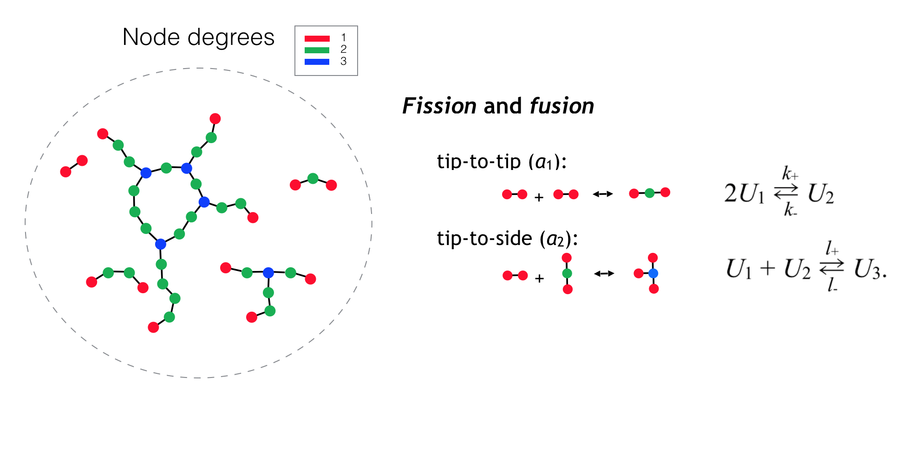

#  mitoSim

### A stochastic simulator of graphs evolving under the action of division and fusion of components

### Biological interpretation: mitochondria

Mitochondria are organelles in biological cells essential for keeping the cells alive.
They are able to move around the cytosol (intracellular volume outside nucleus), where they 
form extensive rapidly reorganizing networks.
Quantitative description of their morphology and dynamics was problematic
because of the seemingly irregular and constantly changing reticular conformations they can adopt.
This problem is tackled here by representing the mitochondria as a graph evolving in time.

### The dynamics

The graph evolution results from the division and fusion of branches, implemented as a 
time-dependent stochastic process. Specialized protein complexes performing these 
transformations in the mitochondria are known from empirical studies, but the dynamics is not 
dependent on the details of their operation and may be implemented in more general terms.  
In this minimal representation, node degrees are constrained to a very narrow range (1, 2 and 3),
and only the graph topology is accounted for, thus neglecting the embodiment of the network in space.
Such formulation corresponds to a well-mixed chemical system, so that any graph node has 
equal probability to interact with any other node appropriate for the reaction type.
The evolution corresponds to a minimization of the free energy of node interactions.
So, in the coarse of the simulation run, the network settles in a dynamic steady-state configuration,
defined by the reaction parameters and the network dimensions.
Formally, the process corresponds to a solution of the master equation describing the t
ransformations in continuous time.

More details can be found in the original 
[publication](https://journals.plos.org/ploscompbiol/article?id=10.1371/journal.pcbi.1002745):  
Sukhorukov VM, Dikov D, Reichert AS, Meyer-Hermann M: Emergence of the mitochondrial 
reticulum from fission and fusion dynamics.
PLoS Comput Biol. 2012, 8: e1002745-10.1371/journal.pcbi.1002745.  
Please reference the above manuscript whenever the results produced by this code are made publicly available.

### Installation

#### Dependencies

The simulator makes use of the general-purpose library [utils](https://github.com/vsukhor/utils), 
(included here as a git submodule).
So, when cloning, please make sure, that the dependent library is included, e.g., by applying:

    git clone --recursive https://github.com/vsukhor/mitoSim.git

and, in the case of an update, do this explicitly on the submodule:

    git submodule init
    git submodule update

#### Building

Current code requires a C++20 - capable compiler. It was tested on macOS (clang-12) and Ubuntu (gcc-11).
For generation of pseudo-random numbers, [Utils::Random](https://github.com/vsukhor/utils/tree/master/utils/random)
relies on either [boost](https://www.boost.org/) or [NVIDIA cuRAND](https://developer.nvidia.com/curand), so
depending on the underlying generator chosen, one of these should be accessible (in the case 
of the former, the headers suffice).

Using [cmake](https://cmake.org) (ver. 3.15 or higher):  
    `cd mitosim`  
    `cmake -S . -B build`  
    `cmake --build build`  

### Running the simulation

The simulation parameters are read from a short configuration file, structured
as in the example [config_sample.txt](examples/config_sample.txt).
More details on the config file formatting can be found in the
Utils::Config [documentation](https://github.com/vsukhor/utils/blob/master/utils/config/conf_file_structure.md)
The file is expected to be named as 'config_X.txt', where X is the configuration-specific suffix 
and the rest of the name is fixed.
Then, using the above example, and the executable 'mitosim_CPU' simulation may be launched as

    ./mitosim_CPU   /working/directory/   sample   22   28

The first two arguments are the working directory where the config file is positioned and the 
config file suffix respectively. The last two arguments are the range limits of the run indexes 
used for choosing rng seeds.

### Analyzing the results

Python 3 code for basic visualization and analysis of simulation results can be found in 
[mitosim-postProcessor](https://github.com/vsukhor/mitosim-postProcessor).
The scripts can be used independently of the main C++ code,  provided the output files are 
available (see the [instructions](https://github.com/vsukhor/mitoSim-postProcessor/blob/main/README.md)).
